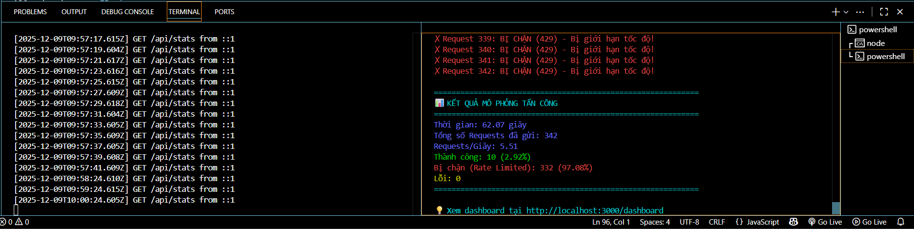
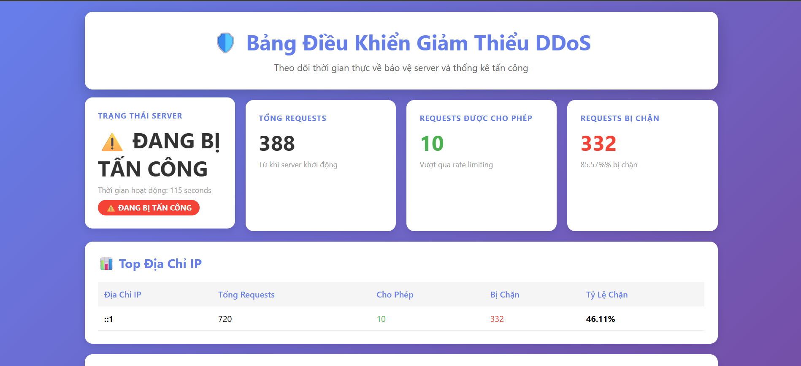

# 🏆 [MÔ PHỎNG TẤN CÔNG DDOS NHỎ VÀ TRIỂN KHAI BIỆN PHÁP GIẢM THIỂU-RATE LIMITING TRONG NGINX/EXPRESS.JS]

## 1. 📝 Tóm Tắt Dự Án

Dự án **[MÔ PHỎNG TẤN CÔNG DDOS NHỎ VÀ TRIỂN KHAI BIỆN PHÁP
GIẢM THIỂU-RATE LIMITING TRONG NGINX/EXPRESS.JS]** là một hệ thống **[ Ngăn chặn DDOS dựa trên NodeJS]** được xây dựng nhằm **[Mục tiêu chính: phát hiện và giảm thiểu các cuộc tấn công flooding]**.

---

## 2. 👨‍💻 Thành Viên và Phân Chia Công Việc

| STT | Họ và Tên | Mã số SV | Vai trò | Công việc Chính |
|:---:|:---:|:---:|:---:|:---|
| 1 | [Đinh Xuân Việt] | [22810310343] | Leader, Back-end | Xây dựng thuật toán phát hiện và Server Logic. |
| 2 | [Trần Đức Linh] | [22810310342] | Developer | Xây dựng giao diện Dashboard và API phụ. |


---

## 3. ⚙️ Hướng Dẫn Khởi Chạy (Quick Start)

### 3.1. Yêu cầu Hệ thống

* **Node.js:** Phiên bản [Ví dụ: v18.x trở lên]
* **npm:** Trình quản lý gói

### 3.2. Các Bước Cài đặt

1.  **Clone Repository:**
    ```bash
    git clone [https://github.com/zietbinn/Phat_trien_web_an_toan.git]
    git checkout production
    ```

2.  **Cài đặt Thư viện:**
    ```bash
    npm install
    ```

3.  **Khởi chạy Ứng dụng:**
    ```bash
    npm start 
    ```
    *Ứng dụng sẽ chạy tại địa chỉ: [http://localhost:3000]*

---

## 4. 🖼️ Hình Ảnh Kết Quả Demo

### 4.1 🖼️ Hình Ảnh Mô phỏng chạy server và lệnh tấn công hỗn hợp



### 4.2 🖼️ Hình Ảnh Dashboard hiển thị mô phỏng



---

## 5. 🎬 Link Video Demo

* **Link Video Demo:** [https://drive.google.com/file/d/1Ou8uT48L--Dqp7Yv54KmHWy-IDABGpCl/view?usp=sharing]
